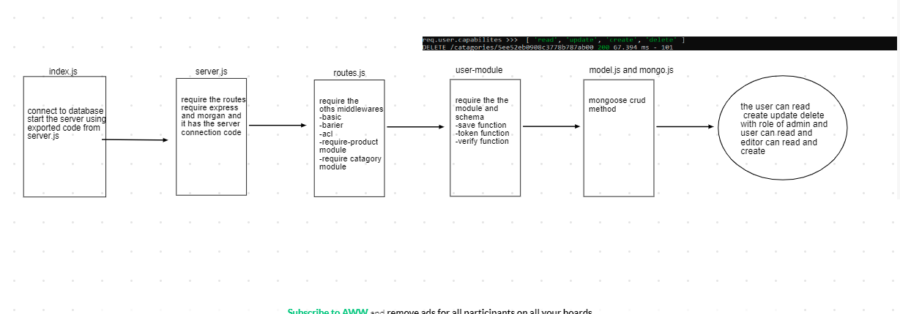

# LAB - Class 15 auth

## Project: lab-5

### Author: Alaa almasri

### Links and Resources

- [submission PR](https://github.com/alaaalmasri12/authenticated-api-server/pull/1)

### Setup

#### `.env` requirements (where applicable)

i.e.
- `PORT` - 3000
- `MONGODB_URI`'mongodb://localhost:27017/lab-5-auth';
- `SECRET`='mysecrettokenkey';
- `CLIENT_ID`'a3d5d1c9e20a6abcdddc';
- `CLIENT_SECRET`'e2178a3504dd77b223a9d2167f91c720030b4d03';
- `tokenServerUrl` 'https://github.com/login/oauth/access_token';
- `remoteUserApi` 'https://api.github.com/user';
- `API_SERVER` 'http://localhost:3000/oauth';
#### How to initialize/run your application (where applicable)

- e.g. `nodemon`

#### UML

